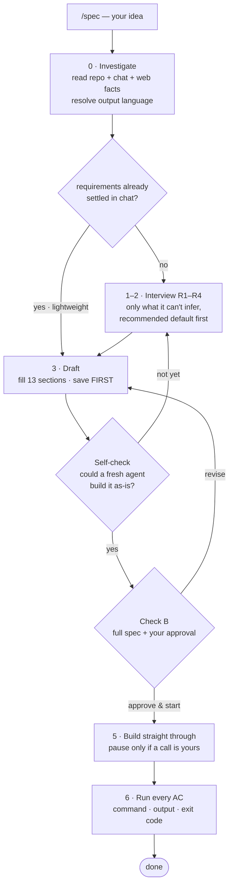
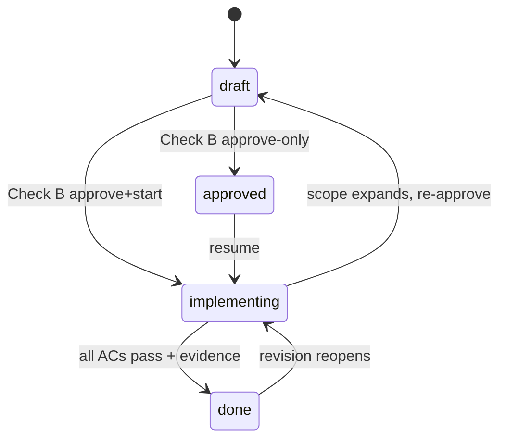

<h1 align="center">spec-skill</h1>

<p align="center">
  <strong>Decide it up front. Then build without the back-and-forth.</strong><br>
  先に、決め切る。あとは、迷わず作らせる。
</p>

<p align="center">
  <a href="LICENSE"></a>
  <a href="https://docs.claude.com/en/docs/claude-code"></a>
  
  <a href="CHANGELOG.md"></a>
</p>

<p align="center">
  A spec-driven workflow <strong>skill for <a href="https://docs.claude.com/en/docs/claude-code">Claude Code</a></strong>.<br>
  Hand a vague task to an AI and it guesses, drifts, and makes the wrong call. <code>spec</code> front-loads every<br>
  decision into one file your agent can't misread — so it builds straight through.
</p>

<p align="center">
  <em>The test a spec must pass: a fresh session, given only that file, could build it as-is.</em>
</p>

<p align="center">Built and maintained by <a href="https://github.com/dualform-labs">dualform-labs</a> · <a href="#english">English</a> · <a href="#日本語">日本語</a></p>

---

## At a glance

Every number here is verifiable straight from the source:

| | | how to verify |
|---|---|---|
| **1 file, 0 runtime dependencies** | the whole skill is one prompt | `ls skills/spec/` → just `SKILL.md` |
| **~220 lines of prompt** | the entire ruleset | `wc -l skills/spec/SKILL.md` |
| **13-section spec template** | every spec, same shape | §1–§13 in `SKILL.md` |
| **2 checkpoints** | a "could a fresh agent build it?" self-check + your approval | Check A & Check B, below |
| **interview rounds** | coarse → fine, as many as it takes (R1–R4 is the guide, not a cap) | R1–R4 in `SKILL.md` |
| **4 lifecycle states** | `draft → approved → implementing → done` | status line in every spec |
| **install: one `cp`** | drop into `~/.claude/skills/` | see [Install](#install) |
| **output language: `ja` / `en` / `auto`** | specs & questions in your language | `skills/spec/config.yml` |

---

## English

### The 30-second version

Hand a vague task to an AI agent and you watch the same thing happen: it guesses, it drifts, it silently makes a call you'd have made differently — and you redo half the work. The cost isn't the typing. It's the rework.

`spec` moves every decision to the **front**, where changing your mind is cheap, and writes them into one file your agent can't misread. You invoke it with `/spec <one-line idea>`, answer a short batch of multiple-choice questions, approve the result — and it builds straight through, pausing only when a call is genuinely yours to make.

### Before / after

| Typical agent session | With `/spec` |
|---|---|
| "Build me X" → it starts coding immediately | It reads your repo first, then asks only what it *couldn't* infer |
| Assumptions made silently as it goes | Every decision is a line in the spec, with a recommended default you can reject |
| You discover the wrong call after it's built | You see all of them up front, before a line is written |
| "Done!" — but a stub that only looks finished | "Done" requires a command run on a real case, with the output and exit code pasted |
| Next session has no idea what you decided | The spec file carries every decision across sessions and hand-offs |

### What a run actually looks like

```text
you > /spec a menu-bar app that warns me when my Mac is thermally throttled

spec > (reads the repo, harvests the chat — asks only what it can't infer.
        fresh idea, no repo yet → picks Swift/SwiftUI, noted as a placeholder you can veto)

        Round 1 · direction
          Q1. When is this "a success"?  → [warned in time to act] (recommended) / …
          Q2. Just you, or shipping to others?  → [personal] (recommended) / …
          Q3. What is explicitly OUT of v1?  → [no history graphs, no fan control] / …

        Round 2 · skeleton …      Round 3 · edges & non-functionals …

        self-check passed  → handed the draft to a fresh agent with ONLY the spec file.
                        it could build it as-is. spec passes.

        approve?  → here is the full spec (13 sections). approve / revise / defer

you > approve & start

spec > (builds straight through — pausing only if a call is truly yours)
        AC-1: `swift build` → exit 0
        AC-2: throttle simulated → menu-bar icon turns red within 2s
        Done. Command, output, exit code logged in §13. Placeholders re-listed so you keep a veto.
```

Nothing above is special-cased — that's just the loop: **investigate → ask up front → write the spec → build straight through.**

### How it works — two checkpoints

The discipline is enforced at two checkpoints, not by good intentions:

- **Check A — the self-check.** *Before you see anything*, the draft is handed to a fresh-context sub-agent with **only that file** and asked: "could you build this as-is?" If it still has something to ask, that's a section not yet pinned down — and it gets fixed before you're shown anything. (No sub-agents in your setup? It falls back to a 12-point self-audit that must quote one grounding line per section — a section it can't quote is treated as not done.)
- **Check B — your approval.** The full spec is shown as plain text (not a summary), and you pick **approve & start / revise / approve-only**. "Approve & start" flows straight into implementation in the same session.

**During the build, it asks at the right moment — not never.** It won't re-ask what's already settled, but it *does* stop for the things that deserve it: the irreversible (deleting data, publishing, spending) and a new fork only you can decide. The goal isn't silence; it's putting the questions where they belong — up front, or at a genuine decision point.

And completion is **anti-Potemkin**: every acceptance criterion must be an executable command or a numbered visual check — never "file exists" or "imports OK". A criterion a *stub* could pass is rejected by design. A feature is `done` only after it's been run on a real case and the output shown.

### How it's built

There is no engine. The whole skill is **one prompt** (`SKILL.md`, ~220 lines) plus a one-line `config.yml`. The "logic" is a set of rules the agent follows — and the two checks exist to force those rules to actually hold rather than quietly get skipped.

**The loop.** Investigate → ask up front → draft → check → build → verify. The only human checkpoint is Check B:



**The lifecycle.** A spec moves through four states, and every transition is a real edit to the file's `status` line — never just a verbal claim. That's what lets an interrupted session resume exactly where it stopped:



The two checks map onto the loop: **Check A** is the machine check between drafting and showing you anything; **Check B** is the single human checkpoint.

### Install

The skill is a single `SKILL.md` — no build, no dependencies:

```bash
git clone https://github.com/dualform-labs/spec-skill.git

# User scope — available in every project
cp -r spec-skill/skills/spec ~/.claude/skills/

# — or — Project scope — checked into one repo
cp -r spec-skill/skills/spec /path/to/your/project/.claude/skills/
```

Start a new Claude Code session and `/spec` is live.

#### Choose the output language

By default, `spec` writes the spec file and its questions in the **language of your conversation** (`auto`). To pin it to Japanese or English, edit one line in `skills/spec/config.yml`:

```yaml
output_language: en      # auto (default) | ja | en
```

Code, commands, file paths, and slugs always stay in English regardless of this setting. The change takes effect on the next Claude Code session.

### Usage

```text
/spec a menu-bar app that warns me when my Mac gets thermally throttled
/spec specs/inventory-alert.md      # revise or resume an existing spec
/spec                               # infer the target from recent conversation
```

For one-line edits, `spec` deliberately steps aside — it's for work that **spans multiple files, has two or more decisions only you can make, or is expensive to redo.**

### What's in a spec — 13 sections

One fixed template keeps every spec comparable and complete:

| § | Section | § | Section |
|---|---------|---|---------|
| 1 | Purpose & definition of success | 8 | Non-functional requirements (numeric) |
| 2 | Users & context | 9 | Environment, constraints, prohibitions |
| 3 | Scope (do / won't-do) | 10 | Integration with existing assets |
| 4 | I/O & interface | 11 | Acceptance criteria (executable) |
| 5 | Main flow & state | 12 | Decision log — yours (D) vs. AI's (T) |
| 6 | Data & persistence | 13 | Implementation log & evidence |
| 7 | Error handling & worst-case | | |

§12 is two-layered on purpose: **your decisions (D)** are never re-asked; **AI placeholders (T)** stay visible so you keep a veto, even mid-implementation.

### Design principles

> Investigate before you ask. Once you ask, write it down. Once approved, run it to the end.

- **Don't ask what you can find out.** "What language is this project?" wastes a question and erodes trust. The questions it *does* ask are the ones only you can answer — each with a recommended default you can reject in a tap.
- **No non-functional agreement without a number.** "Fast" isn't settled until it's "within N seconds".
- **No `done` without evidence.** The implementation log holds the real command, output, and exit code — not "it should work".

### An honest note on numbers

We don't publish efficiency percentages we haven't measured — that would be exactly the kind of unfounded claim a spec is meant to kill. The numbers in this README are **structural and verifiable**: one file, zero dependencies, a 13-section template, two checks you can watch fire in any run. If you want to feel the difference, run `/spec` on a real feature and notice how rarely it interrupts you *after* approval — and that the times it does are the ones that genuinely need you.

### Requirements & honest notes

- **Claude Code.** Relies on the slash-command and (optionally) sub-agent mechanisms. Check A is strongest with sub-agents available, and degrades gracefully to a self-audit table without them.
- **Output language is configurable.** Set `output_language` in `skills/spec/config.yml` to `auto` (match your conversation — the default), `ja`, or `en`. The skill's own internal ruleset is authored in Japanese, but the specs and questions it produces follow your setting; code, commands, and slugs always stay English.
- Community project, **not affiliated with or endorsed by Anthropic**.

### License

[Apache License 2.0](LICENSE) · see [NOTICE](NOTICE).

---

## 日本語

### 30秒で言うと

曖昧な依頼を AI エージェントに渡すと、毎回おなじことが起きます。推測し、脱線し、あなたなら違うふうに決めたはずの判断を黙って下す —— そして半分やり直し。失う時間の正体は、タイピングではなく手戻りです。

`spec` はその判断を、考え直すコストが安い **最初** に動かし、AI が読み違えようのない1つのファイルに書き込みます。`/spec <一行の概要>` で呼び出し、短い選択式の質問に答え、結果を承認すれば —— あとは迷わず作り進み、本当にあなたにしか決められない時だけ、手を止めて確認します。

### Before / After

| よくあるエージェント | `/spec` を使うと |
|---|---|
| 「Xを作って」→ いきなりコードを書き始める | まずリポを読み、**調べても分からないことだけ** 聞く |
| 進めながら仮定を黙って積む | すべての判断が仕様書の1行になり、断れる推奨案が付く |
| 間違った判断に、作った後で気づく | 1行も書く前に、すべてを先に見られる |
| 「完成!」— でも見た目だけのスタブ | `done` には実ケースでの実行・出力・exit code が必須 |
| 次のセッションは何を決めたか知らない | 仕様書がすべての判断をセッションと引き継ぎを越えて運ぶ |

### 実際の動き

```text
あなた > /spec Mac が熱で性能を絞られたら教えてくれるメニューバーアプリ

spec  > (リポと会話を読み、調べて分からないことだけ聞く。新規アイデアでリポ無し →
         macOS メニューバー app として Swift/SwiftUI を仮置きし、拒否可能なことを明記)

         ラウンド1 · 方向
           Q1. これが「成功」なのはどんな時?  → [手遅れになる前に気づける](推奨) / …
           Q2. 自分専用? 配布?  → [自分専用](推奨) / …
           Q3. v1 で明確にやらないことは?  → [履歴グラフなし・ファン制御なし] / …

         ラウンド2 · 骨格 …      ラウンド3 · 異常系と非機能 …

         自己チェック完了  → 仕様書 *だけ* を別の AI に渡した。このまま作れる。仕様書は合格。

         承認?  → 仕様書の全文(13項目)です。承認 / 修正 / あとで

あなた > 承認して開始

spec  > (まっすぐ作り進む — あなたにしか決められない時だけ手を止めて確認)
         AC-1: `swift build` → exit 0
         AC-2: 熱絞りを模擬 → 2秒以内にメニューバーが赤くなる
         完了。コマンド・出力・終了コードを §13 に記録。仮置き一覧を再掲し、拒否権を保持。
```

上のどれも特別扱いではありません。これがループそのものです — **調べる → 先に聞く → 仕様書を書く → まっすぐ作る。**

### 動作 — 2つの関門

規律は善意ではなく、2つの関門で守られます。

- **関門A — 自走チェック。** *提示の前に*、仕様書 **だけ** を別の AI(fresh-context のサブエージェント)に渡し、「このまま作れる?」と尋ねます。まだ聞きたいことが残るなら、それは詰め切れていない項目 —— あなたに見せる前に、そこを埋めます。(サブエージェントが無い環境では、各項目から根拠行を1つ引用する12観点の自己点検にフォールバックし、引用できない項目は未完成とみなします。)
- **関門B — あなたの承認。** 仕様書の全文を(要約でなく)プレーンテキストで提示し、**承認して開始 / 修正 / 承認のみ** を選びます。「承認して開始」なら同一セッションでそのまま実装に入ります。

**実装中は、正しいタイミングで聞きます —— 決して「聞かない」のではなく。** 決まったことは聞き直しませんが、確認すべきことには **ちゃんと止まって聞きます** —— 後戻りできない操作(データ削除・公開・課金)や、あなたにしか決められない新しい分岐です。目指すのは「黙って進むこと」ではなく、質問をあるべき場所(最初か、本物の分岐点)に置くことです。

完成判定は **anti-Potemkin** です。受け入れ基準はすべて、実行できるコマンドか番号付きの目視手順でなければならず、「ファイルが存在する」「import が通る」は不可。*スタブでも通る* 基準は設計上はじかれます。実ケースで走らせ出力を示して初めて `done` です。

### 仕組み

エンジンはありません。skill 全体が **1つのプロンプト**(`SKILL.md`・約220行)と1行の `config.yml` です。「ロジック」はエージェントが従う規則の集まりで、2つの関門は、その規則が黙って飛ばされず実際に守られることを強制するために存在します。

**ループ。** 調べる → 先に聞く → 起草 → 関門 → 作る → 確かめる。人間のチェックポイントは関門Bの1箇所だけです:


**ライフサイクル。** 仕様書は4つの状態を移り、どの遷移もファイルの `status` 行への実際の編集です — 口頭宣言ではありません。これが、中断したセッションを止まった所から正確に再開できる理由です:


2つの関門は上のループに対応します。**関門A** は起草と提示の間の機械的チェック、**関門B** は唯一の人間チェックポイントです。

### インストール

skill は単一の `SKILL.md` — ビルドも依存もありません。

```bash
git clone https://github.com/dualform-labs/spec-skill.git

# ユーザースコープ — 全プロジェクトで使える
cp -r spec-skill/skills/spec ~/.claude/skills/

# — または — プロジェクトスコープ — 特定リポに含める
cp -r spec-skill/skills/spec /path/to/your/project/.claude/skills/
```

新規セッションを開けば `/spec` が使えます。

#### 出力言語を選ぶ

`spec` は既定で、仕様書とその質問を **会話の言語**(`auto`)で書きます。日本語または英語に固定したい場合は、`skills/spec/config.yml` の1行を編集します:

```yaml
output_language: ja      # auto(既定)| ja | en
```

コード・コマンド・パス・slug は、この設定に関わらず常に英語です。変更は次の Claude Code セッションから有効になります。

### 使い方

```text
/spec Mac が熱で性能を絞られたら教えてくれるメニューバーアプリ
/spec specs/inventory-alert.md      # 既存スペックの改訂・再開
/spec                               # 直近の会話から対象を推定
```

一行で終わる小修正には、`spec` はあえて発動しません — **複数ファイルにまたがる・あなたにしか決められない分岐が2つ以上ある・やり直しコストが高い**、そういう作業のためのものです。

### 仕様書の中身 — 13セクション

1つの固定テンプレートが、どの仕様書も比較可能で漏れのない状態に保ちます。

| § | セクション | § | セクション |
|---|-----------|---|-----------|
| 1 | 目的と成功の定義 | 8 | 非機能要件(数値で) |
| 2 | 利用者と文脈 | 9 | 環境・制約・禁止事項 |
| 3 | スコープ(やる / やらない) | 10 | 既存資産との統合 |
| 4 | 入出力とインターフェース | 11 | 受け入れ基準(実行可能) |
| 5 | 主要フローと状態 | 12 | 決定記録 — 本人(D) vs AI(T) |
| 6 | データと永続化 | 13 | 実装ログと検証証拠 |
| 7 | 異常系の方針・最悪事故 | | |

§12 は意図的に二層です。**本人決定 (D)** は再質問されず、**AI仮置き (T)** は見える形で残るので、実装中もあなたは拒否権を持ち続けます。

### 設計の原則

> 調べてから聞く。聞いたら書く。承認されたら、最後まで走り切る。

- **調べれば分かることを聞かない。** 「このプロジェクトの言語は?」級は質問枠の浪費で、信頼を失います。実際に聞くのは、あなたにしか答えられないことだけ —— どれもワンタップで断れる推奨案つきです。
- **数値なしの非機能合意をしない。** 「速い」は「N秒以内」になるまで確定扱いしません。
- **証拠なしで `done` と言わない。** 実装ログには実際のコマンド・出力・exit code が残ります — 「動いたはず」ではなく。

### 数字についての正直な但し書き

測っていない効率の数値(「手戻りが N%減る」等)は載せません — それこそ、spec が消そうとしている「根拠のない主張」そのものだからです。この README の数字は **構造的で検証可能** なものに限っています。1ファイル・0依存・13セクションのテンプレート・どの実行でも目にできる2つの関門。違いを体感したければ、実際の機能に `/spec` をかけ、承認 *後* にどれだけ中断が少ないか、そして中断する時はどれも本当にあなたを必要としている時だ、と確かめてみてください。

### 動作要件・正直な補足

- **Claude Code 専用。** スラッシュコマンドと(任意で)サブエージェント機構に依存します。関門Aはサブエージェントがあると最も強力で、無くても自己点検に穏やかに縮退します。
- **出力言語は設定可能。** `skills/spec/config.yml` の `output_language` を `auto`(会話に合わせる・既定)・`ja`・`en` から選べます。skill 自身の内部ルールは日本語で書かれていますが、生成される仕様書と質問はこの設定に従います。コード・コマンド・slug は常に英語です。
- コミュニティ製のプロジェクトで、**Anthropic 社とは無関係・非提携** です。

### ライセンス

[Apache License 2.0](LICENSE) · [NOTICE](NOTICE) を参照してください。
